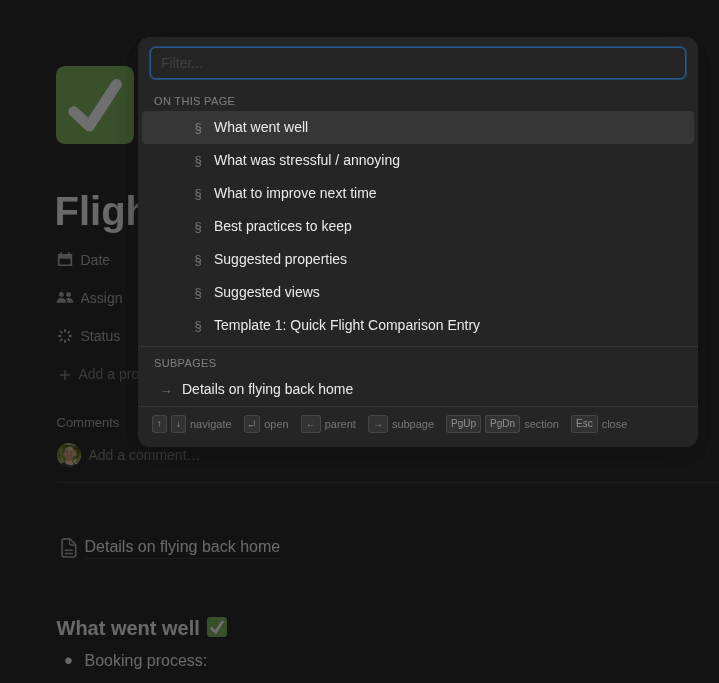

# Notion Breadcrumb Navigator

A lightweight browser extension that adds keyboard-driven navigation to Notion. Press **Ctrl+B** to open a command palette that lets you jump between parent pages, headings on the current page, and subpages — without touching the mouse.

Works in Chrome, Brave, Edge, Safari, and any Chromium-based browser.



## Demo

[▶  View Demo on Loom](https://www.loom.com/share/72f065c862374d3ba101119751f3f266)

## Features

- **Parent pages** — navigate up the page hierarchy
- **On this page** — jump to any heading in the current document
- **Subpages** — navigate into child pages
- **Search/filter** — type to instantly filter the list
- **Persistent overlay** — stays open when switching between pages so you can keep navigating
- **Dark mode** — automatically matches Notion's theme

## Installation

### Chrome / Brave / Edge (any Chromium browser)

This is an unpacked extension — no store download required. You load it directly from a folder on your computer.

#### 1. Download the extension

**Option A — Clone with Git:**

```
git clone https://github.com/felixbrock/notion-breadcrumbs.git
```

**Option B — Download ZIP:**

Click the green **Code** button on GitHub, then **Download ZIP**. Extract the ZIP to a folder on your computer.

#### 2. Load in your browser

1. Open your browser's extension page:
   - **Chrome:** `chrome://extensions`
   - **Brave:** `brave://extensions`
   - **Edge:** `edge://extensions`
2. Turn on **Developer mode** (toggle in the top-right corner)
3. Click **Load unpacked**
4. Select the `notion-breadcrumb-nav` folder (the one containing `manifest.json`)

The extension is now active. Navigate to any [Notion](https://www.notion.so) page and press **Ctrl+B** to try it.

#### Updating

If you cloned with Git, pull the latest changes and reload:

```
cd notion-breadcrumb-nav
git pull
```

Then go back to the extensions page and click the reload icon on the extension card. If you downloaded the ZIP, re-download and replace the folder, then reload.

---

### Safari (macOS)

Safari requires extensions to be wrapped in a native macOS app. Apple provides a one-command converter that does this for you. You will need:

- A Mac
- **Xcode** (free from the [Mac App Store](https://apps.apple.com/app/xcode/id497799835))

#### 1. Download the extension

Same as above — clone the repo or download and extract the ZIP.

#### 2. Convert to a Safari extension

Open **Terminal** and run:

```
xcrun safari-web-extension-converter /path/to/notion-breadcrumb-nav \
  --app-name "Notion Breadcrumb Navigator" \
  --bundle-identifier com.notion-breadcrumb-nav.extension \
  --swift
```

Replace `/path/to/notion-breadcrumb-nav` with the actual path to the folder. For example, if you downloaded it to your home directory:

```
xcrun safari-web-extension-converter ~/notion-breadcrumb-nav \
  --app-name "Notion Breadcrumb Navigator" \
  --bundle-identifier com.notion-breadcrumb-nav.extension \
  --swift
```

This generates an Xcode project and opens it automatically.

#### 3. Build the app

1. In Xcode, click the **Play button** (triangle icon in the top-left) to build and run
2. If Xcode asks you to select a team, you can select your personal team (no paid developer account needed for personal use)
3. The app will launch — you can close it; the extension is now installed

#### 4. Enable the extension in Safari

1. Open **Safari** > **Settings** > **Advanced**
2. Check **Show features for web developers**
3. Go to **Safari** > **Settings** > **Developer**
4. Check **Allow unsigned extensions**
5. Go to **Safari** > **Settings** > **Extensions**
6. Enable **Notion Breadcrumb Navigator**

> **Note:** Safari resets the "Allow unsigned extensions" setting every time you quit Safari. You will need to re-enable it each session (step 4). This limitation only applies to locally built extensions — it does not apply if the extension is distributed through the App Store.

#### Updating

Pull the latest changes (or re-download the ZIP), then rebuild in Xcode by clicking the Play button again. No need to re-run the converter unless `manifest.json` changed.

---

## Usage

Press **Ctrl+B** on any Notion page to open the navigator.

### Keyboard shortcuts

| Key                   | Action                                 |
| --------------------- | -------------------------------------- |
| `Ctrl+B`              | Open / close the navigator             |
| `↑` `↓`               | Move selection up / down               |
| `Enter`               | Open the selected item                 |
| `←`                   | Navigate to selected parent page       |
| `→`                   | Navigate into selected subpage         |
| `Page Up` `Page Down` | Jump between sections                  |
| `Tab` / `Shift+Tab`   | Move selection down / up (alternative) |
| `Esc`                 | Close the navigator                    |

Start typing to filter the list. The search bar is focused automatically when the navigator opens.

### Sections

The navigator shows up to three sections depending on what's available on the current page:

- **Parent pages** — ancestors in the page hierarchy (the breadcrumb trail). Use `←` or `Enter` to go up.
- **On this page** — headings (H1, H2, H3) in the current document. Selecting one scrolls to it. Indentation reflects the heading level.
- **Subpages** — child pages nested under the current page. Use `→` or `Enter` to go in.

When you navigate to a parent or subpage, the navigator reopens automatically on the new page so you can keep moving through the hierarchy.

## How it works

The extension is three files:

| File            | Purpose                                                                                                    |
| --------------- | ---------------------------------------------------------------------------------------------------------- |
| `manifest.json` | Tells the browser to inject the script on `notion.so`                                                      |
| `content.js`    | Reads the page DOM for breadcrumbs, headings, and subpages; handles keyboard input and renders the overlay |
| `styles.css`    | Styles the overlay to match Notion's look and feel                                                         |

No data leaves your browser. The extension only reads the DOM of the Notion page you're on and has no network permissions.

## Troubleshooting

**The navigator doesn't open:**
Make sure you're on `www.notion.so` (not a custom domain or the desktop app). Check that the extension is enabled on the extensions page. On Safari, make sure "Allow unsigned extensions" is enabled (it resets when Safari quits).

**Ctrl+B does something else:**
Ctrl+B normally triggers bold text in Notion. This extension overrides that. You can still bold text using the toolbar or by typing `**text**` in Markdown.

**Parent pages don't show up:**
Parent pages are read from Notion's breadcrumb bar. If you're on a top-level page (no parents), the section won't appear. If it's missing on a nested page, Notion may have changed its DOM structure — please open an issue.

**Subpages are missing or wrong items appear:**
The extension looks for elements with the `.notion-page-block` class. Database views and linked pages may not be detected. If incorrect items appear, please open an issue with a screenshot.

**Safari: "Allow unsigned extensions" keeps turning off:**
This is a Safari limitation for locally built extensions. You need to re-enable it each time you restart Safari. The only way to avoid this is to distribute the extension through the Mac App Store, which requires an Apple Developer Program membership ($99/year).

**Safari: Xcode build fails:**
Make sure you have the latest version of Xcode. If the build fails with a signing error, go to the project settings in Xcode, select your personal team under "Signing & Capabilities", and try again.

## License

MIT
